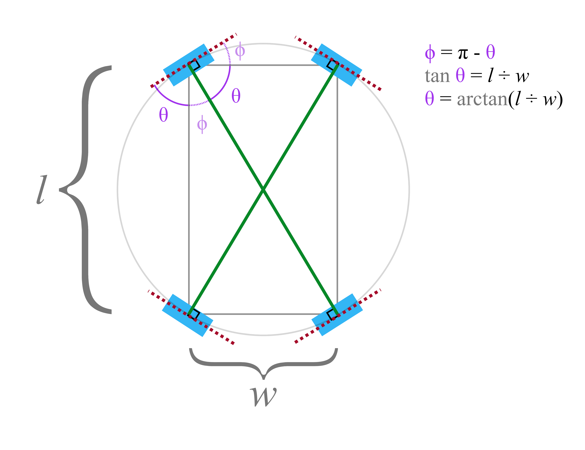

Control scheme
==============

The ESHS 2020 FRC robot uses a _swerve drive_.  Like a shopping cart, all four wheels on the drive can be rotated and driven independently.

Proposal
--------

* **Joysticks**
  - One joystick controls *strafing*.
    * The magnitude of the joystick's vector controls speed.
	* The orientation of the joystick's vector controls the pivot/swerve angle.
  - One joystick controls *rotation*.
    * The left/right channel of the joystick controls turning speed.
	* Turning requires the wheels to align so they are tangent to the robot's circle:
	  
* **Keyboard**
  - WASD keys control *strafing.*
  - Left and right arrow keys control *rotation*.

Discussion
----------

* There are four swerve drive schemes discussed in FRC Team 1640's [excellent resource](https://team1640.com/wiki/images/8/85/Pivot-Wheel_Drive.pdf):
    1. **Crab mode**: All 4 wheels pivot in unison and drive at the same speed.
	    * Advantages:
		    - Simple to program
			- Analogous to the "strafing joystick" the ESHS VEX team uses for Mecanum drives		
		* Disadvantages:
		    - Purported orientation drift (may be possible to mitigate with a gyro)
	2. **Snake mode**: Robot has a turning center; inner and outer wheels align to be tangent to circles sharing that center
	    * Advantages:
		    - Robot moves with a natural gait, weaving around obstacles like a snake
		* Disadvantages:
		    - Tough to program.  How are the inner and outer wheel tangents calculated?
	3. **Automobile mode**: The front wheels pivot as in snake mode, while the rear wheels remain fixed
	    * Advantages:
		    - Slightly easier to program than snake mode
		* Disadvantages:
		    - Only slightly easier to program than snake mode.  The front wheels should _not_ be parallel when turning.
            - Not as easy to maneuver	
	4. **Tank mode**: Turn my moving wheels on left/right sides in opposite directions
	    * Advantages: Very easy to program
		* Disadvantages: With a 4-wheel drive, the longer the robot is lengthwise (**y-bias**), the more friction and wheel damage a tank drive turn will generate.
		
		    Things slightly improve when the tank driving happens on the shortest edge, but for our robot, that would mean being oriented sideways.

* We also discussed two additional schemes:
    1. **Sidefacing tank mode**: Uses a button to change tank scheme from lengthwise (**y-bias**) to widthwise (**x-bias**).
	    * Advantages: 
		    - The only realistic way to do tank mode on a rectangular bot is along the short side
		* Disadvantages: 
		    - May be awkward to drive with.  Which direction is currently the front?
			- X-biased tank driving may reduce friction, but it won't eliminate it completely
	2. **Rook style**: Robot travels lengthwise and width-wise straight, like a chess rook, but rotates by spinning in place.
	    * Advantages:
		    - Combines the best of crab mode (strafing without changing orientation) with the best of snake mode (turning with a radius of 0)
		* Disadvantages:
		    - Robot must take time to pivot in place, and then more time to return to normal driving
			
* So far, **rook style** seems to offer the best balance.